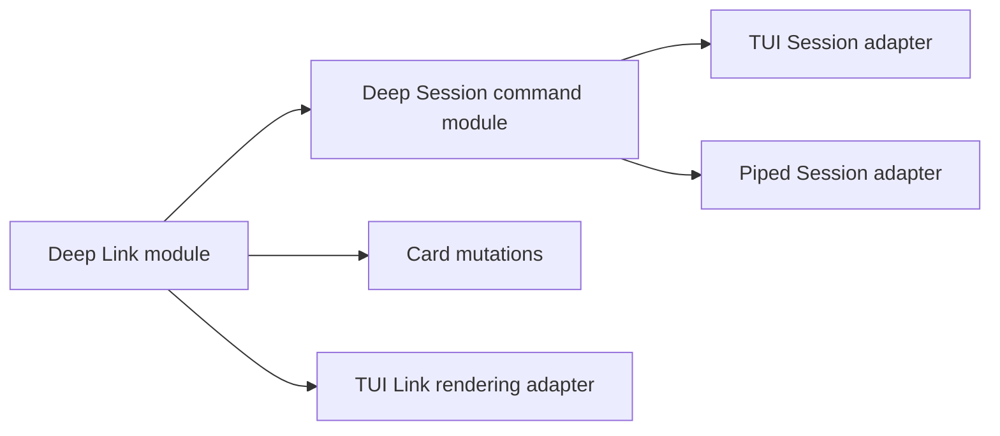
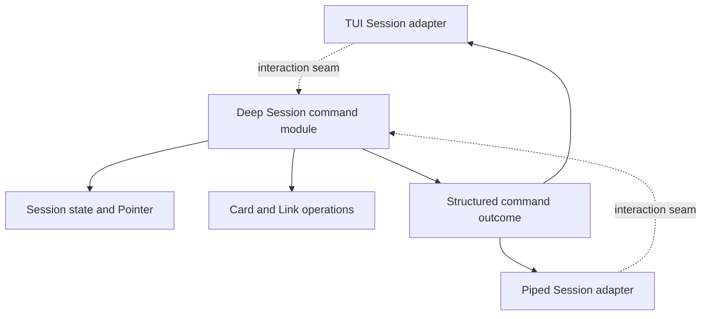

# Link Lifecycle and Session Command Policy Deepening Design

Status: implemented and verified on 2026-07-22.

## Goal

Deepen two currently shallow areas without changing observable ZT behavior:

1. Concentrate Link parsing, validation, classification, rewriting, Reverse link derivation, and Broken link reporting in one Link module.
2. Concentrate Session command meaning and Pointer transitions in one Session command module while retaining separate TUI and piped adapters.

This document records the architecture. Implementation was later authorized through PRD #43 and issues #44-#49; it did not include a version change, installation, or release.

## Source Authority

- `CONTEXT.md` defines Card, Literature Card, Citation key, Location, Pointer, Session, Link, Broken link, Reverse link, Direct successor, and Side successor.
- `doc/zt-note-system-design.md` defines the active Card, Link, Reverse link, Broken link, Session, and Pointer behavior.
- `doc/literature-card-design.md` defines Link behavior shared by Location and Citation key targets.
- `doc/session-interactive-tests-and-edit-caret-design.md` defines the separate TUI and piped Session paths and the TUI editor model.
- `doc/session-mouse-selection-and-clipboard-design.md` defines TUI-only mouse and clipboard behavior.
- `doc/session-bare-subcommands-design.md` and `doc/session-bare-go-root-design.md` define bare Session syntax and navigation behavior.
- `src/main.rs` and `src/session.rs` are the current implementation authority.

## Precedence

This design changes internal ownership only.

- It does not supersede any user-visible behavior in the source documents above.
- It supersedes only the internal instruction in `doc/session-bare-subcommands-design.md` that the two command handlers should remain close to their current duplicated structure.
- It does not require the internal synthetic `zt` prefix to survive. Bare Session input and exact errors must survive; the internal token shape is not observable behavior.
- If implementation exposes an undocumented behavior difference, implementation stops and the difference is resolved explicitly before code proceeds.

## Architecture Decisions

### Behavior preservation

The first implementation of both deepenings is a zero-behavior-change refactor.

- Existing commands, arguments, errors, output ordering, confirmations, Pointer outcomes, Card mutations, and transaction behavior remain unchanged.
- Existing TUI and piped differences remain unchanged unless a later design explicitly changes them.
- New strictness, new syntax, new commands, new persistence, and new recovery behavior are out of scope.
- Existing CLI and PTY tests remain acceptance tests; focused tests are added at each new module interface.

### Existing domain language is sufficient

Both deepened modules are named after concepts already present in `CONTEXT.md`: Link and Session. No glossary change is required.

### Dependency order

The Link module is implemented first. The Session command module may then consume the Link module's structured Broken link results instead of preserving another Link scanner.



## Deepen the Link Lifecycle

### Pre-implementation friction

Link knowledge was split across several implementations:

- `extract_link_targets` scanned and validated Link macros.
- `validate_card_text` decided whether an edit introduced a Broken link.
- `regenerate_reverse_links_tx` scanned Card bodies and derived Reverse link text.
- `replace_link_targets` independently scanned and rewrote Link targets.
- `count_target_links` independently counted rewrite impact.
- `cmd_lsbk` and `tui_lsbk` independently enumerated Broken links.
- `write_tui_link_line` independently scanned, classified, and rendered Link macros.

Deleting any one scanner would have made its parsing rules reappear in its caller. Those scanners earned their keep, but the interface was shallow because each caller had to know Link syntax and lifecycle rules.

### Module responsibility

One crate-private Link module owns all interpretation of `[[target]]` text.

The module owns:

- recognition of Link macro syntax;
- validation of Location and Citation key targets;
- exact source ranges and target text for each Link occurrence;
- classification as valid or Broken against a supplied Card snapshot;
- the current old-versus-new Broken link edit rule;
- target counting for move and Citation-key rename previews;
- exact body-only target rewriting;
- Reverse link derivation;
- Broken link result derivation;
- the generated Reverse link wording and deterministic ordering.

The module does not own:

- SQLite connections, queries, transactions, or schema;
- the edit lock;
- Card save, delete, move, or Citation-key rename orchestration;
- terminal rows, columns, colours, mouse hit testing, or soft wrapping;
- shell or Session output formatting;
- Card title, body, and Reverse link section splitting;
- Location topology or Citation-key metadata rules outside their use as Link targets.

### Interface shape

The interface is outcome-oriented. Callers ask for Link behavior; they do not scan raw text themselves.

The exact Rust names are not locked, but the shape is:

```rust
let body = LinkBody::parse(card_body)?;
let occurrences = body.occurrences();
let rewritten = body.rewrite_targets(&mapping)?;

let lifecycle = LinkLifecycle::from_cards(&cards)?;
let broken = lifecycle.broken_links();
let reverse_sections = lifecycle.reverse_sections();
let rewritten_cards = lifecycle.rewrite_targets(&mapping)?;
```

`LinkBody` provides one canonical interpretation of a Card body. `LinkLifecycle` adds cross-Card knowledge from an immutable Card snapshot. Internal parser types remain private unless a caller genuinely needs their data.

### Dependency strategy

The Link module receives Card snapshots containing only the data required for Link behavior: Card address, title, and body.

- Storage loads the snapshots before calling the module.
- Storage applies returned changes inside its existing SQLite transaction.
- The Link module never opens SQLite.
- There is one production storage implementation, so no storage trait or storage adapter seam is introduced.
- Focused tests construct snapshots directly.

This keeps the Link interface independent of persistence without inventing a hypothetical seam.

### Locked Link behavior

The deepened module preserves all of the following:

- A Link macro is exactly `[[target]]`; display text is unsupported.
- A target is either a valid Location or a valid Citation key.
- Citation key case remains significant.
- Only the client-authored Card body contributes outbound Links.
- Card titles, BibTeX metadata, and generated Reverse link sections are never scanned as outbound Link sources.
- A newly introduced Link is rejected when its target does not exist.
- An already-Broken target may remain during an unrelated edit.
- For this refactor, "new Broken link" continues to mean a target absent from the old broken-target set. Occurrence-count semantics are not introduced.
- Duplicate Links from one source Card create one Reverse link line on the target Card.
- Broken links create no Reverse link line.
- Deleting a target preserves inbound Link macros in source Card bodies and makes them Broken links.
- Location moves and Citation-key renames rewrite only actual Link targets in Card bodies.
- Rewriting preserves every byte outside the target range, including surrounding whitespace, punctuation, line breaks, Card titles, BibTeX metadata, and Reverse link sections.
- Rewrite previews count Link macro occurrences, matching current output.
- Reverse link text uses the existing exact wording and deterministic source ordering.
- Reverse link regeneration remains part of the caller's existing atomic save, delete, move, or Citation-key rename transaction.
- Valid rendered Links remain highlighted and clickable.
- Broken rendered Links remain visibly Broken and are not clickable.
- TUI terminal geometry and mouse hit spans remain the TUI adapter's responsibility.

### Malformed text compatibility

Supported writes continue to reject malformed Link macros with the existing user-facing errors.

Manually corrupted stored Link text is outside the supported Card contract, but the refactor does not gain permission to erase useful current behavior:

- TUI and piped reading continue to show the stored body without making malformed fragments clickable.
- Writes continue to reject malformed Link syntax.
- Link operations that require strict interpretation fail clearly and write nothing.
- No automatic repair is introduced.

The characterization tests in Phase 1 record the exact current errors and rendering before a scanner is replaced. Any additional difference is a blocking design question, not permission to choose a new behavior during refactoring.

### Consumer migration

| Current consumer | After deepening |
|---|---|
| Card save validation | asks the Link module to validate the edit against the Card snapshot |
| Reverse link regeneration | applies Reverse link sections derived by the Link module |
| Move and Citation-key rename | applies exact rewrites and occurrence counts returned by the Link module |
| Shell `zt lsbk` | formats structured Broken link results |
| TUI Session `lsbk` | formats the same structured Broken link results for the TUI message area |
| TUI Card view | maps Link occurrences and validity to terminal styling and hit spans |

After migration, raw `[[` scanning outside the Link module is prohibited except in tests and literal user-facing text.

### Link test surface

Focused tests at the Link interface cover:

- valid Location and Citation key macros;
- invalid target grammar, unmatched opening text, and unmatched closing text;
- exact source ranges with multiple Links on one line;
- repeated Link occurrences;
- existing-versus-new Broken target behavior;
- body-only rewriting and exact byte preservation;
- Location and Citation-key mappings;
- occurrence counts used in previews;
- one Reverse link line per source Card and target;
- Broken link structured results and source-line preservation;
- deterministic Reverse link ordering and exact wording;
- valid and Broken classification used by the TUI adapter.

Existing CLI and PTY tests continue to prove save rejection, old Broken link preservation, delete consequences, move and Citation-key rewrite behavior, `lsbk`, highlighting, mouse activation, and Pointer outcomes.

## Collapse Session Command Policy

### Pre-implementation friction

Before this design was implemented, `handle_tui_command` and `handle_session_command` both implemented the full Session command set.

Each handler owned command matching, arity, errors, Card preconditions, storage calls, confirmation flow, and Pointer transitions. Mode-specific editing and presentation were interleaved with shared command meaning.

Deleting either handler without the shared seam would have moved the same command rules into its adapter. TUI and piped Sessions are two real adapters, so command policy now lives behind their shared seam.

### Module responsibility

One crate-private Session command module owns:

- normalization and parsing of bare Session input;
- command names and arity;
- exact unknown-command and usage errors;
- command preconditions at `ROOT`, a Location, or a Citation key;
- Card operation selection;
- confirmation requirements;
- Pointer transitions after success;
- whether a command continues or exits the Session;
- semantic results for read-only commands;
- success versus error outcomes that drive adapter redraw behavior.

The Session command module does not own:

- crossterm events, raw mode, alternate-screen state, or terminal drawing;
- piped stdin reading or stdout formatting;
- mouse selection, clipboard access, or Link hit testing;
- the TUI `EditorModel` or piped edit-byte protocol;
- mode-specific edit and confirmation presentation;
- shell command parsing or shell-only commands;
- SQLite transaction implementation;
- the Session reading projection beyond the data required by a command result.

### One real seam, two adapters

The TUI and piped paths remain separate adapters because their interaction behavior genuinely varies.



The adapters may format a structured result differently. They may not interpret command strings, duplicate command preconditions, or assign Pointer outcomes independently.

### Interface shape

The module has one command-execution entry point. The exact Rust names are not locked, but the shape is:

```rust
let outcome = commands.execute(
    &mut session_state,
    raw_command_line,
    &mut interaction_adapter,
)?;
```

The implementation hides parsing, command dispatch, preconditions, storage orchestration, and Pointer transitions.

The interaction seam exposes only behavior that genuinely varies between the two adapters:

- edit Card text;
- edit Literature Card metadata;
- choose the Literature Card edit part;
- confirm delete, move, or Citation-key rename.

Structured read results are returned in the command outcome. Each adapter presents those results in its current mode-specific format.

The seam must not become one method per Session command. That would copy the shallow command interface into the adapters instead of deepening it.

### Session state ownership

The Session command module owns changes to the Session Pointer.

- Adapters may read the Pointer to render a view.
- Adapters do not directly move the Pointer after commands.
- A failed command leaves the Pointer unchanged.
- A canceled edit or confirmation preserves the current Pointer and Card data according to the existing command contract.
- Successful create, edit, delete, move, `go`, bare `go`, and `root` operations retain their current Pointer outcomes.

### Locked Session behavior

The deepened module preserves:

- bare Session input without an executable prefix;
- whitespace trimming and blank-input behavior;
- no shell-style quote parsing for `t <title>`;
- `unknown session command: <first-token>`;
- `usage: go [<target>]` for extra `go` arguments;
- bare `go` and `root` returning the Pointer to `ROOT`;
- `go <target>` resolving an existing Location or Citation key;
- shell `zt go` remaining unavailable;
- all current Session commands and Session-only help text;
- edit lock, validation, transaction, confirmation, and Card mutation behavior;
- successful and failed Pointer outcomes;
- `q`, Ctrl+C, and disconnect behavior;
- TUI message clearing after the same successful commands as today;
- current piped view-redraw behavior after successful commands;
- current no-redraw behavior after piped command errors.

### Adapter-specific behavior that remains distinct

| Concern | TUI adapter | Piped adapter |
|---|---|---|
| Input | crossterm events and one-line command bar | line-oriented stdin |
| Edit | `EditorModel`, mouse, clipboard, save/cancel keys | existing byte-oriented edit protocol |
| Confirmation | TUI modal with selection and clipboard behavior | line prompt on stdout/stdin |
| Read results | compact message-area formatting | current line-oriented formatting |
| `stats` | current compact single-line result | current multi-line result |
| `status` | current compact Session result | current detailed line-oriented result |
| `lsbk` | current joined message and `no broken links` text | current shell-style lines |
| Redraw | TUI frame redraw | current piped view print after success |

These are adapter responsibilities, not reasons to duplicate command meaning.

### Relationship to shell commands

Shell dispatch in `src/main.rs` remains separate and unchanged.

Where Session code currently calls shell functions that print directly, implementation separates data retrieval from formatting. Shell and Session adapters may reuse data-returning functions, but shell syntax and shell output remain unchanged.

This design does not merge shell commands into the Session command module and does not add Pointer state to shell commands.

### Session test surface

Focused tests at the Session command interface cover:

- every command name and arity;
- whitespace, blank input, and `zt ...` rejection;
- command availability at `ROOT`, Location, and Citation key Pointers;
- success, error, and cancellation Pointer outcomes;
- structured results for `ls`, `stats`, `status`, `lsbk`, and `help`;
- edit and confirmation calls through scripted TUI-like and piped-like adapters;
- identical command meaning across both adapters;
- adapter-specific formatting and redraw decisions remaining distinct.

Existing PTY tests continue to prove the real TUI adapter. Existing CLI integration tests continue to prove the real piped adapter and shell separation.

## Implementation Sequence

### Phase 1: Characterize

1. Add focused behavior tests around Link cases not already explicit, especially malformed stored text and repeated Broken targets.
2. Record the current TUI-versus-piped result and redraw matrix for every Session command.
3. Run the full suite before moving ownership.

### Phase 2: Deepen Link

1. Add the Link module and its focused tests.
2. Route validation and Link occurrence counting through it.
3. Route exact rewriting through it.
4. Route Reverse link and Broken link derivation through it.
5. Route TUI Link classification through it while keeping terminal geometry in the TUI adapter.
6. Delete the old independent scanners only after every consumer has moved.

### Phase 3: Collapse Session command policy

1. Add Session state, structured outcomes, and the interaction seam.
2. Move navigation and read-only command meaning first.
3. Move create and edit command meaning.
4. Move delete, move, and Citation-key rename confirmations.
5. Remove both duplicated command match blocks only when TUI and piped tests use the shared module.

Each step reaches green before the next ownership move. File movement alone is not progress; the old implementation is deleted only when complexity has concentrated behind the new interface.

## Implementation Record

- `src/link.rs` now owns the sole production scan of raw `[[target]]` syntax, immutable Card snapshots, validation and rendering classification, exact target rewriting, Reverse link derivation, and structured Broken link results.
- `src/session/command.rs` now owns the sole production Session command matcher, Session state and Pointer transitions, semantic results, and the shared edit/choice/confirmation interaction seam.
- `src/session.rs` retains the distinct TUI and piped event, editing, confirmation, formatting, redraw, mouse, and clipboard adapters. The former duplicated command handlers and synthetic-prefix normalizer were deleted.
- SQLite connections, edit locking, transactions, shell dispatch, terminal geometry, and user-visible syntax remain with their prior owners. No schema, storage trait, command, flag, recovery state, or Link syntax was added.
- Repository searches find raw Link delimiter scanning only in `src/link.rs`, one production `match parts.as_slice()` only in `src/session/command.rs`, and none of the superseded scanner or handler names.
- Verification passed `cargo fmt -- --check`, `cargo check --all-targets`, `cargo clippy --all-targets -- -D warnings`, `git diff --check`, and serialized `cargo test --all-targets -- --test-threads=1`: 68 unit tests, 56 CLI/service tests, and 26 automated PTY tests passed; one explicitly manual real-clipboard smoke remained ignored.

## Non-Goals

- No new Link syntax or display text.
- No structural Link table or cached Link index in SQLite.
- No schema migration.
- No new storage trait.
- No Location topology refactor.
- No broad Card mutation refactor.
- No Session reading-projection refactor beyond structured command results.
- No merge of TUI and piped event loops.
- No new TUI framework.
- No shell command changes.
- No new commands, flags, configuration, recovery state, or telemetry.
- No user-facing wording or formatting changes.

## Acceptance

The architecture change is complete only when:

- one Link module is the only production implementation that scans raw Link macro syntax;
- validation, rewriting, Reverse link derivation, Broken link reporting, and TUI Link classification cross the Link module interface;
- one Session command module is the only production implementation that matches Session command names and owns Pointer transitions;
- TUI and piped adapters contain only their genuinely different interaction and presentation behavior;
- no storage trait exists while SQLite remains the only storage implementation;
- focused Link and Session command tests pass;
- existing CLI integration and PTY tests pass unchanged except for mechanical test access needed by the refactor;
- `cargo fmt --check`, `cargo check`, and the full `cargo test` suite pass;
- repository-wide searches find no duplicate production Link scanner or Session command match block;
- active documentation remains consistent with this behavior-preserving ownership change.

## Open Decisions

None. Exact private Rust type and function names remain implementation details as long as the ownership, seam placement, behavior, and acceptance contract above are preserved.
